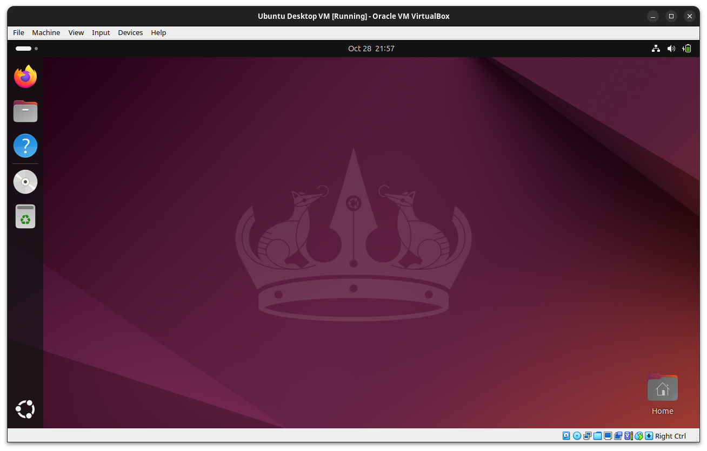

# Ubuntu Desktop in Vagrant

Provision reproducible and consistent Ubuntu desktop virtual machines using [Vagrant](https://www.vagrantup.com/) and [VirtualBox](https://www.virtualbox.org/).



<https://gitlab.com/brlin/ubuntu-desktop-vagrant>  
[](https://gitlab.com/brlin/ubuntu-desktop-vagrant/-/pipelines) [](https://github.com/brlin-tw/ubuntu-desktop-vagrant/actions/workflows/check-potential-problems.yml) [](https://pre-commit.com/) [](https://api.reuse.software/info/gitlab.com/brlin/ubuntu-desktop-vagrant)

## Features

In order to improve the out-of-the-box user experience, this product introduces changes including but not limited to:

* Disable features that are not useful in the virtual machine use case (suspend, user authentications, and lock screens).
* Workaround known bugs in the VirtualBox guest drivers.
* Reduced boot time by optimizing VM configurations.
* Improved default console size and aspect ratio.
* Suppress unnecessary input-capturing warning user interfaces.
* Include common Vagrantfile template configuration for further customizations.
* Support configuring localization and default input method for the following locales:
    + [Chinese(China)](doc-assets/input-sources-zhcn.png)
    + [Chinese(Taiwan)](doc-assets/input-sources-zhtw.png)
    + [Japanese(Japan)](doc-assets/input-sources-jajp.png)

## Prerequisites

The following prerequisites must be satisfied in order to use this solution:

* The host system must have the following software installed and has its commands available in the command search PATHs:
    + OPTIONAL - (Your preferred archive extraction application/utility)  
      For extracting the downloaded product release archive.
    + OPTIONAL - (Your preferred HTTPS client/Web browser)  
      For downloading the product release archive.
    + Vagrant  
      For provisioning the virtual machine that runs the Ubuntu desktop environment.
    + Oracle VirtualBox(must be in a version that your Vagrant installation supports, as of 2024/10/25 it is 7.0.\*)
* The host system must have access to the Internet in order to retrieve the virtual machine image and other guest packages.

## Usage

Follow the following instructions to use this solution:

1. Download the product release archive from [the Releases page](https://gitlab.com/brlin/ubuntu-desktop-vagrant/-/releases).
1. Extract the product release archive.
1. Launch a text terminal.
1. Change the working directory to the extracted product release directory by running the following command:

    ```bash
    cd /path/to/ubuntu-desktop-vagrant-X.Y.Z
    ```

1. Review and, when necessary, edit [the Vagrantfile](Vagrantfile) to satisfy your requirements.  Refer to [the Environment variables that can change the behavior of the provision program section](#environment-variables-that-can-change-the-behavior-of-the-provision program) for settings that can customize some of the VM provisioning details.
1. Run the following command to provision the Ubuntu desktop virtual machine:

    ```bash
    vagrant up
    ```

   A VM console window should popup, allowing you to operate the desktop environment.

   You can also run the following command to gain access to a text shell:

    ```bash
    vagrant ssh
    ```

1. OPTIONAL: Run the following command to destroy the virtual machine:

    ```bash
    vagrant destroy
    ```

   All data will be lost after the operation.

## Environment variables that can change the behavior of the provision program

The following are the environment variables that can change the behavior of the provision program, which can be set in the `config.vm.provision :shell, path: "vagrant-assets/provision.sh"` call in [the Vagrantfile](Vagrantfile):

### ENABLE_VBOXADD_INSTALLATION

Whether to re-install the VirtualBox Guest Additions, which should fix some problems of the guest support drivers from the distribution installation.

Setting the value of this environment variable to `false` can reduce the time required for re-provisioning the system.

**Supported values:**

* `true`
* `false`

**Default value:** `true`

### INSTALL_LANGUAGE_SUPPORT

Specify whether to install language support packages, and if it should be installed, which locale should be used.

**Supported values:**

* `null`: Don't install language support packages
* Values supported by the `-l` option of the `check-langauge-support` command:
    + _ll_
    + _lll_
    + _ll_\__CC_
    + _lll_\__CC_
    + _ll_@_variant_
    + _lll_@_variant_
    + _ll_\__CC_@_variant_
    + _lll_\__CC_@_variant_
    + `zh-hans`
    + `zh-hant`

**Default value:** `null`

## Credits

We would like to express our gratitude to Yoshimasa Niwa, [who implemented and published the original implementation](https://gist.github.com/niw/bed28f823b4ebd2c504285ff99c1b2c2/0338af262d2c6664ed4ec2a2fc8d3f0b8b5d25f6).

## References

The following material are referenced during the development of this project:

* [A simple Vagrantfile to setup Ubuntu desktop environment with Google Chrome and Japanese input](https://gist.github.com/niw/bed28f823b4ebd2c504285ff99c1b2c2)  
  The inspiration of this project.
* [Shell Scripts - Provisioning | Vagrant | HashiCorp Developer](https://developer.hashicorp.com/vagrant/docs/provisioning/shell)  
  Explains how to run external provision shell scripts in a Vagrantfile.
* [Redirections (Bash Reference Manual)](https://www.gnu.org/software/bash/manual/html_node/Redirections.html#Here-Documents)  
  Explains how to use the Here Documents feature of the Bash shell scripting language.
* [Bug #1933248 “please drop virtualbox-guest-dkms virtualbox-guest...” : Bugs : virtualbox package : Ubuntu](https://bugs.launchpad.net/ubuntu/+source/virtualbox/+bug/1933248)  
  Explains the reason why the virtualbox-guest-dkms package is no longer available in recent Ubuntu releases.
* [Bug #2076520 “Ubuntu 24.04 LTS VBox VM does not boot anymore \[...” : Bugs : linux package : Ubuntu](https://bugs.launchpad.net/ubuntu/+source/linux/+bug/2076520)  
  Bug report regarding the problem where guest support no longer works when upgrading the Ubuntu kernel on a Ubuntu 24.04 system.
* [How to "insert" guest additions image in VirtualBox from command line, while VM is running? - Unix & Linux Stack Exchange](https://unix.stackexchange.com/questions/309980/how-to-insert-guest-additions-image-in-virtualbox-from-command-line-while-vm)  
  Explains how to programmically attach the VirtualBox Guest Additions installation ODD image to the virtual machine.
* [VBoxManage | Oracle VirtualBox: User Guide](https://www.virtualbox.org/manual/topics/vboxmanage.html)  
  Explains how to use the `storagectl` and `storageattach` `VboxManage` sub-commands.
* [jeffskinnerbox/ubuntu-desktop: Vagrant Base Box for Ubuntu Desktop](https://github.com/jeffskinnerbox/ubuntu-desktop)  
  Project with a similar goal and different customizations.
* [dotless-de/vagrant-vbguest: A Vagrant plugin to keep your VirtualBox Guest Additions up to date](https://github.com/dotless-de/vagrant-vbguest)  
  A Vagrant plugin that provides way to install/update the VirtualBox Guest Additions in the guest VM.  It is obsoleted, though...
* [vagrant-proxyconf - Proxy Configuration Plugin for Vagrant](https://tmatilai.github.io/vagrant-proxyconf/)  
  A Vagrant plugin that configures the guest VM to use user-specified proxy settings.
* [tmatilai/vagrant-timezone: Vagrant plugin that configures the time zone of a virtual machine](https://github.com/tmatilai/vagrant-timezone)  
  A Vagrant plugin that configures the guest VM to use user-specified timezone settings.
* [Creating a Base Box | Vagrant | HashiCorp Developer](https://developer.hashicorp.com/vagrant/docs/boxes/base)  
  Explains how to create a base box for other Vagrant users to initialize from.
* [Guest Additions | Oracle VirtualBox: User Guide](https://www.virtualbox.org/manual/topics/guestadditions.html#guestadd-dnd)  
  Explains the Drag and Drop support of VirtualBox.
* [Virtual Machine Name - Configuration - VirtualBox Provider | Vagrant | HashiCorp Developer](https://developer.hashicorp.com/vagrant/docs/providers/virtualbox/configuration#virtual-machine-name)  
  Explains how to customize the VM name that appears in the VirtualBox GUI.
* [config.vm.hostname - config.vm - Vagrantfile | Vagrant | HashiCorp Developer](https://developer.hashicorp.com/vagrant/docs/vagrantfile/machine_settings#config-vm-hostname)  
  Explains how to customize the guest VM hostname.
* [Configure automatic login](https://help.gnome.org/admin/system-admin-guide/stable/login-automatic.html.en)  
  Explains how to configure automatic login in GDM.
* [sudo - How do I prevent PolicyKit from asking for a password? - Ask Ubuntu](https://askubuntu.com/questions/98006/how-do-i-prevent-policykit-from-asking-for-a-password)  
  Explains how to implement password prompt override in Polkit.
* [pklocalauthority](https://www.freedesktop.org/software/polkit/docs/0.105/pklocalauthority.8.html)  
  Explains basic information and configuration paths of the Local Authority Polkit authority implementation.
* [linux - Possible values for `uname -m` - Stack Overflow](https://stackoverflow.com/questions/45125516/possible-values-for-uname-m)  
  Explains the possible values of the `uanme -m` command's output, and where do they came from.
* [ArchitectureSpecificsMemo - Debian Wiki](https://wiki.debian.org/ArchitectureSpecificsMemo)  
  Enumerates the mapping of the `uname -m` output and the debian architecture names.

## Licensing

Unless otherwise noted(individual file's header/[REUSE.toml](REUSE.toml)), this product is licensed under [the MIT license](https://opensource.org/license/mit).

This work complies to [the REUSE Specification](https://reuse.software/spec/), refer the [REUSE - Make licensing easy for everyone](https://reuse.software/) website for info regarding the licensing of this product.
